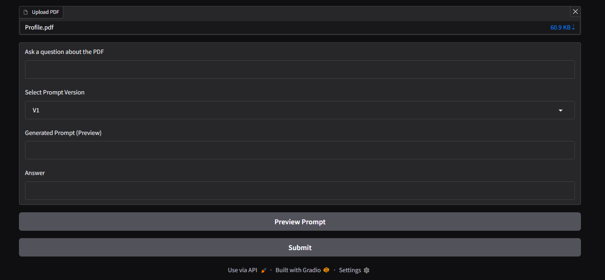
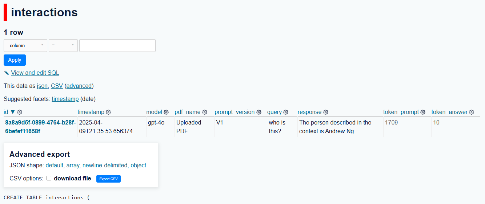

# build-with-llms

This project was made in the context of the [Building LLM Applications for Data Scientists and Software Engineers](https://maven.com/hugo-stefan/building-llm-apps-ds-and-swe-from-first-principles) course in which we will be building applications using LLMs

How to run:

## Set up

```
git clone
```

Activate the working enviromenment and install the requirements
```
python3 -m venv .venv
source .venv/bin/activate
pip install -r requirements.txt
```

Set your environmental variables with your API keys
```
source .env
```

Run for testing

```
python app_pdf_profile.py
```

It will display the UI



Display the logs in a different terminal

```
source .venv/bin/activate
```

Display the logs on the database

```
datasette pdf_qa_logs_hw1b.db
```



## Deployment with [Modal](https://modal.com/)

To deploy with modal you set up your account in the website.

## **Quick Setup Instructions**

1. **Install Modal SDK**

In your Codespace terminal:

```
pip install modal
```

1. **Authenticate Modal**

•	Run:

```
modal token new
```

•	Click the link that appears to authorize your session in the browser.

•	Once complete, Modal will generate an API token for future runs.

1. **Add Your API Keys as Secrets**

Add any necessary API keys to Modal (e.g., OpenAI, Hugging Face):

```
modal secret create <SECRET_NAME>
```

These secrets will be injected into your app during runtime.

1. **Understand the Code Structure**
- app_modal.py: Uses @modal.function decorators to define and serve your app.
- modal_wrapper.py: Wraps Gradio via FastAPI and handles deployment logic.
- Secrets are loaded via Modal’s environment, not stored in plain code.
1. **Deploy the App**

From the deploy/ directory:

```
modal deploy modal_wrapper
```

- This will deploy the app and output a link to access it.
- Your app will continue running after you close your Codespace.

Deploy the database

```
modal deploy modal_datasette
```


